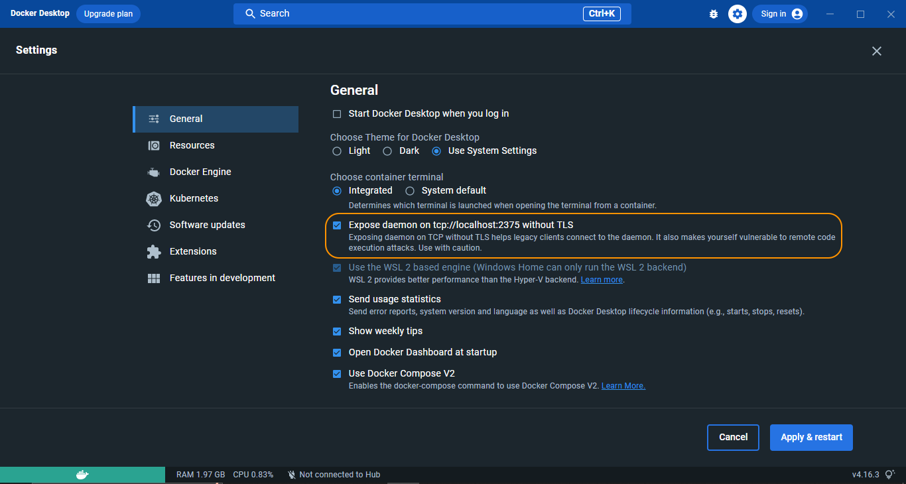
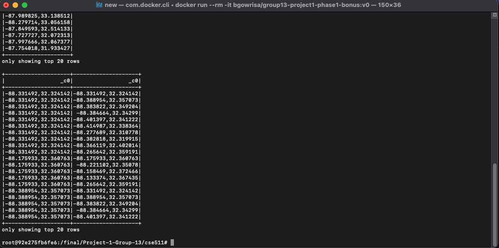

# spatial-hot-spot-analysis

**Problem Description**

In this phase of the project, you are required to do spatial **hot spot analysis**. In particular, you need to  complete two different hot spot analysis tasks.

- **Hot zone analysis**: This task will need to perform a range join operation on a rectangle datasets and a point dataset. For each rectangle, the number of points located within the rectangle will be obtained. The hotter rectangle means that it includes more points. So this task is to calculate the hotness of all the rectangles.
- **Hot cell analysis** : This task will focus on applying spatial statistics to spatio-temporal big data in order to identify statistically significant spatial hot spots using Apache Spark.

The topic of this project phase is inspired from ACM SIGSPATIAL GISCUP 2016. Though we have special requirements in this assignments which are different from the GIS Cup.

Please find the following references on the problem description:

- A detailed problem definition is available [here](http://sigspatial2016.sigspatial.org/giscup2016/problem)
- Evaluation Instructions are available [here](http://sigspatial2016.sigspatial.org/giscup2016/submit)

**Problem Statement**

As stated in the Problem Definition page, in this task, you are asked to implement a Spark program to calculate the Getis-Ord statistic of NYC Taxi Trip datasets. We call it "Hot cell analysis". To reduce the computation power need, we made the following changes:

- The input will be a monthly taxi trip dataset from 2009 - 2012. For example, yellow\_tripdata\_2009-01\_point.csv,yellow\_tripdata\_2010-02\_point.csv
- Each cell unit size is 0.01 \* 0.01 in terms of latitude and longitude degrees.
- You should use 1 day as the Time Step size. The first day of a month is step 1. Every month has 31 days.
- You only need to consider Pick-up Location.
- We don't use Jaccard similarity to check your answer. However, you don't need to worry about how to decide the cell coordinates because the code template generated cell coordinates. You just need to write the rest of the task.


The docker image mentioned below has Spark version 3.3.2, Scala version 2.12.15 and Java version 11.0.16. The `build.sbt` file is modified accordingly to these new versions.

Following are the directions to run the implementation:
1. Pull the docker image from hub:\
    Link: [https://hub.docker.com/r/bgowrisa/group13-project1-phase1-bonus](https://hub.docker.com/r/bgowrisa/group13-project1-phase1-bonus)
    ```
    docker pull bgowrisa/group13-project1-phase1-bonus:v0
    ```
    Note: The following docker image is built on Apple Silicon chipset. So, for windows users if TCP/IP error is thrown then kindly go to Settings > General > Select checkbox "Expose daemon on tcp ... without TLS". The settings page should look like the below figure.
    \
    

2. Run the docker image in interactive mode:
    ```shell
    docker run --rm -it bgowrisa/group13-project1-phase1-bonus:v0
    ```
3. Change directory to project folder:
    ```shell
    cd /final/Project-1-Group-13/cse511
    ```
4. Submit the spark job using spark-submit:\
    The project folder contains the compiled jar file preloaded and log4j.properties file to configure loggings.\
    In case if we want to compile jar file, follow the given steps then execute the spark submit command:
    * Renaming the existing jar file in project folder and in target/scala-2.12 directory:
        ```shell
        mv [Group-13][Project1][Phase1].jar [Group-13][Project1][Phase1].jar.bkp
        mv target/scala-2.12/CSE511-assembly-0.1.0.jar target/scala-2.12/CSE511-assembly-0.1.0.jar.bkp
        ```
    * Execute the following command to compile new jar file:
        ```shell
        sbt assembly
        ```
    * Copy the jar file to project folder:
        ```shell
        cp target/scala-2.12/CSE511-assembly-0.1.0.jar [Group-13][Project1][Phase1].jar
        ```
    Now exceute the following command:
    ```shell
    log4j_setting="-Dlog4j.configuration=file:log4j.properties"
    spark-submit --conf "spark.driver.extraJavaOptions=${log4j_setting}" \
    --conf "spark.executor.extraJavaOptions=${log4j_setting}" \
    [Group-13][Project1][Phase1].jar \
    result/output \
    rangequery src/resources/arealm10000.csv -93.63173,33.0183,-93.359203,33.219456 \
    rangejoinquery src/resources/arealm10000.csv src/resources/zcta10000.csv \
    distancequery src/resources/arealm10000.csv -88.331492,32.324142 1 \
    distancejoinquery src/resources/arealm10000.csv src/resources/arealm10000.csv 0.1
    ```
    
